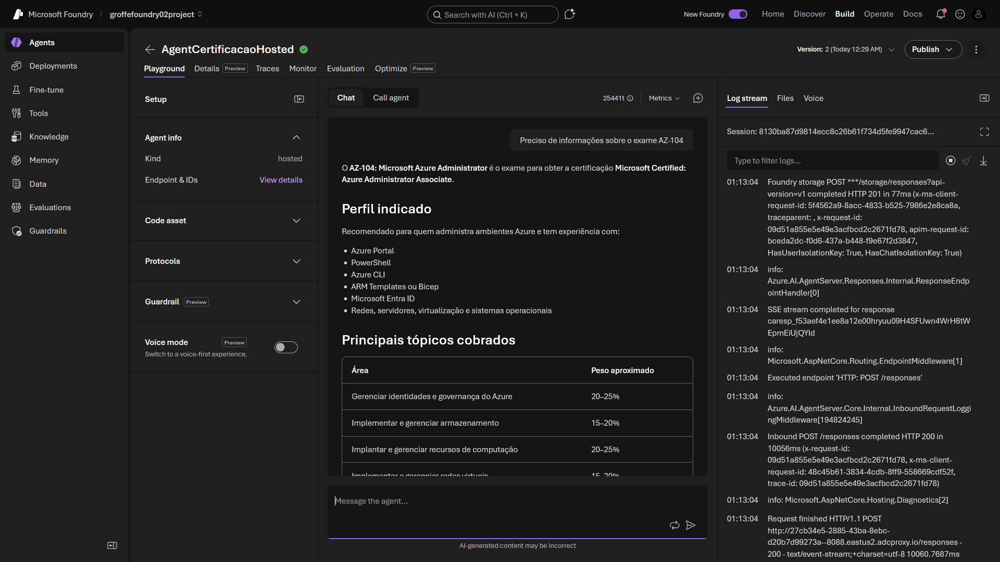
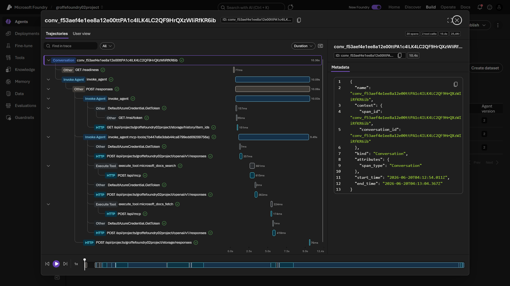
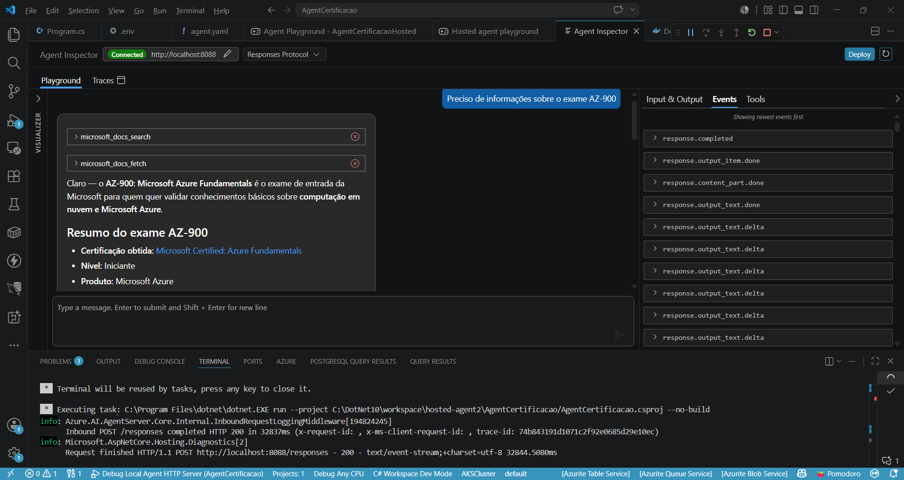

# dotnet10-hosted-agent-mcp_microsoftlearn
Exemplo de implementação de Hosted Agent em .NET 10 para orientar um usuário sobre certificações Microsoft, utilizando para isso o MCP Server do Microsoft Learn. Inclui configurações e Dockerfile para build do agent.

Exemplo que serviu de base para a implementação deste Agent: **x**

Testes via portal do Foundry:

Trace gerado:

Testes a partir do Visual Studio Code:

